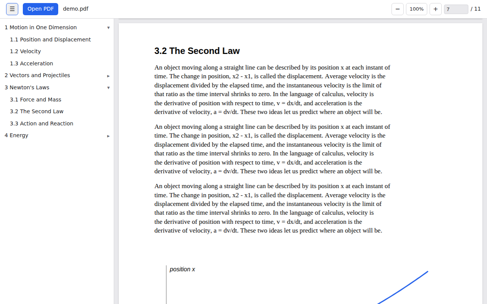

<p align="center">
  
</p>

<h1 align="center">dF — Feather and Differentiation PDF</h1>

<p align="center">
  <b>Open huge PDFs on low-memory Chromebooks without freezing.</b><br>
  An 800MB, 1,000-page textbook on a 4GB Chromebook? It just opens.
</p>

<p align="center">
  <a href="https://gurndar.github.io/df-pdf/"><b>▶ Open dF</b></a> ·
  <a href="#install-it-and-open-pdfs-from-files">Install</a> ·
  <a href="#for-school-it-admins">For IT admins</a> ·
  <a href="CONTRIBUTING.md">Contribute</a>
</p>

<p align="center">
  <a href="https://github.com/gurndar/df-pdf/actions/workflows/test.yml"></a>
  <a href="LICENSE"></a>
</p>

<picture>
  <source media="(prefers-color-scheme: dark)" srcset="docs/screenshot-dark.png">
  
</picture>

## Why
On a 4GB Chromebook, opening a big PDF in the Gallery app or Chrome's built-in viewer can lock up the
whole machine until you hold the power button. Those viewers load the entire file into memory, and an
800MB textbook needs well over 1GB at once.

dF reads only the parts of the file it needs, right from your disk. Memory stays at a few hundred MB
no matter how big the PDF is ([how we measured](experiments/01-load-memory/README.md)).

*Feather* because it is light. *Differentiation* because it is different from every other viewer that
freezes on big files. And *dF* is how you write the differential of F.

- 🔒 **Private**: your PDF never leaves your device. No uploads, no accounts, no tracking.
- 📴 **Works offline** once opened.
- 🏫 **Works on school-managed Chromebooks**: it's a web page, so nothing needs to be installed.

## Features
- Opens multi-hundred-MB PDFs without loading them into memory
- Table of contents sidebar (from the PDF's bookmarks)
- Select and copy text; click links inside the PDF (jump to a page, or open a website in a new tab)
- Remembers the page you were on, per file
- Zoom: buttons, Ctrl `+` / `-` / `0`, Ctrl+scroll or touchpad pinch
- Keyboard: ← / → previous / next page, Home / End, type a page number to jump
- English and Korean UI (follows the browser language)

## Install it and open PDFs from Files
1. Open **https://gurndar.github.io/df-pdf/** in Chrome.
2. Click the install icon in the address bar (or ⋮ → *Cast, save, and share* → *Install page as app*).
3. In the **Files** app, right-click any PDF → **Open with** → **dF**. To make dF the default, choose
   *Change default* in the same menu. After that, double-clicking a PDF opens it in dF.

## For school IT admins
You can push dF to every managed Chromebook so students get it without doing anything:
Google Admin console → **Devices → Chrome → Apps & extensions → Users & browsers** → **+ → Add by URL**
→ `https://gurndar.github.io/df-pdf/`, then set it to **Force install**. It needs no permissions and
sends no data anywhere. The code is small, dependency-free apart from pdf.js, and open for review.

## FAQ
**Is my file uploaded?** No. dF is a static page; the PDF is read from your disk by your browser.

**Why not just use the built-in viewer?** For normal PDFs, that's fine. dF is for the big ones that
freeze your Chromebook.

**Scanned PDFs?** They open and display, but have no text to select (that would need OCR).

**Can I select text in every PDF?** Only PDFs that contain real text. Some print-ready files turn
letters into shapes, and then no viewer can select them.

## How it stays light
- **Range reads**: `File.slice()` feeds pdf.js only the 64KB chunks it asks for (`app/file-range-transport.js`)
- **Virtualized pages**: only the visible pages ±1 have DOM and canvases (`app/viewer.js`), and only
  those pages get a text layer and link layer (`app/page-layers.js`). The picture is drawn first and the
  overlays are added after it
- **One render at a time**, nothing renders while you're scrolling fast
- **Capped canvases**: at most 4M pixels (16MB) per page, freed as soon as the page leaves the screen
- **Downscaled images**: oversized embedded images are shrunk in the worker (`canvasMaxAreaInBytes`)
- **Reopen after a read budget**: pdf.js keeps every chunk it has read for the life of the document.
  After 192MB of reads, dF opens a fresh pdf.js instance for the same file, keeps the pages on
  screen, and destroys the old instance and its worker

## Development
```sh
npm install      # copies pdf.js into app/vendor
npm start        # http://localhost:8080  (add ?debug to show live memory stats)
```
The app is plain static files in `app/`, with no build step. Merging to `main` deploys it to GitHub
Pages. Tests run in real Chromium through Playwright, on every pull request too:
```sh
python3 experiments/01-load-memory/gen.py 1081 full.pdf --outline --links --small   # fast test PDF
npm test -- full.pdf                                  # end-to-end feature checks
python3 experiments/01-load-memory/gen.py 1081 big.pdf --outline --links            # 795MB, realistic
npm run bench -- big.pdf range range-nobudget whole   # peak memory; range:<MB> sets the budget
```
See [CONTRIBUTING.md](CONTRIBUTING.md) for the ground rules and project layout.

## Benchmark
795MB, 1,081 pages, 1366×768 window. Memory is PSS summed over all Chromium processes and includes
the browser's own ~276MB. Each cell shows peak / after the step.

| Step | dF | dF, no reopen | Whole-file loading (typical viewer) |
|---|---|---|---|
| Open + page 1 | 1.9s · 468 / 480MB | 2.4s · 451 / 451MB | 2.3s · 1,102 / 1,104MB |
| Jump to 540 → 1081 | 0.1s · 513 / 502MB | 0.1s · 472 / 472MB | 0.1s · 1,116 / 1,123MB |
| Fast scroll 4s | 502 / 493MB | 517 / 516MB | 1,168 / 1,168MB |
| Read 500 pages in a row | 769 / **610MB** (2 reopens) | 843 / **843MB** | 1,203 / 1,166MB |

- Without reopening, memory grows with everything read, up to the file size. Reopening keeps it near the budget.
- The 500-page peak comes from an extreme test that flips about 25 pages per second. Memory from
  canvases and workers that were already freed gets reclaimed late. Lowering the budget to 64 or 96MB
  doesn't change it (730–750MB).
- A budget that is too low (64MB) causes 40 reopens and gets slower. With a flat page tree, finding
  page N after reopening alone reads tens of MB.

## Known limitations
- Reopening is a workaround. The real fix is an engine that doesn't keep chunks, such as PDFium
  (WASM) with synchronous file reads.
- All pages are laid out at page 1's size. Pages of other sizes are fitted inside that slot.
- Text and link layers add a little work per page. On a dense page (1,277 separately placed words) the
  text and link layers took 56ms after a 44ms canvas render on a fast desktop CPU, so expect several
  times that on a Chromebook. Memory impact in the benchmark was within noise.
- Links use their own small overlay, not pdf.js's full annotation layer, so form fields and other
  interactive annotations are not supported.
- No text search yet. Searching all pages means reading the whole file, which needs a memory-aware design.

## License
[MIT](LICENSE). dF bundles [pdf.js](https://github.com/mozilla/pdf.js) (Apache License 2.0) at
build time; its files in `app/vendor/` keep their own license.
